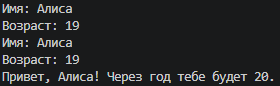
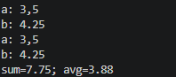
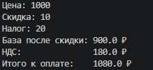
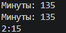
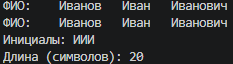
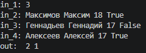
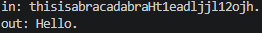

## Лабораторная работа №1: Ввод/вывод и форматирование

### Задание 1 — Привет и возраст
* **Файл:** `src/lab01/01_greeting.py`
* **Ход работы:** `Программа запрашивает имя и возраст пользователя. Затем она преобразует введенный возраст в число. Далее алгоритм увеличивает это значение на один. В конце программа выводит готовое приветствие по шаблону.`
* **Результат работы:**

### Задание 2 — Сумма и среднее
* **Файл:** `src/lab01/02_sum_avg.py`
* **Ход работы:** `Программа считывает два вещественных числа, предварительно заменяя в строках ввода запятые на точки для корректного преобразования. Затем алгоритм вычисляет их сумму и среднее арифметическое. В конце программа выводит результаты в одной строке.`
* **Результат работы:**

### Задание 3 — Чек: скидка и НДС
* **Файл:** `src/lab01/03_discount_vat.py`
* **Ход работы:** `Программа считывает три вещественных числа: исходную цену, процент скидки и процент НДС. Затем она последовательно вычисляет базовую стоимость со скидкой, величину налога и итоговую сумму к оплате по заданным формулам. В конце алгоритм выводит результаты построчно.`
* **Результат работы:**

### Задание 4 — Минуты -> ЧЧ:ММ
* **Файл:** `src/lab01/04_minutes_to_hhmm.py`
* **Ход работы:** `Программа считывает целое число минут и с помощью целочисленного деления на 60 находит количество полных часов. Затем алгоритм вычисляет остаток от деления для получения оставшихся минут. В конце программа выводит результат в формате ЧЧ:ММ.`
* **Результат работы:**

### Задание 5 — Инициалы и длина строки
* **Файл:** `src/lab01/05_initials_and_len.py`
* **Ход работы:** `Программа считывает ФИО одной строкой, очищает её от лишних пробелов по краям и разбивает на отдельные слова для извлечения первых букв каждого слова. Затем она переводит эти буквы в верхний регистр для формирования инициалов и вычисляет длину очищенной от лишних пробелов строки. В конце алгоритм выводит полученные инициалы и количество символов.`
* **Результат работы:**

### Задание 6 — Задача со звездочкой №1
* **Файл:** `src/lab01/06_labrab.py`
* **Ход работы:** `Программа считывает общее количество участников N, а затем в цикле обрабатывает N строк с данными каждого человека. Из каждой строки извлекается последнее значение, определяющее формат участия (очный или заочный), и увеличивает соответствующий счетчик. В конце алгоритм выводит два числа через пробел: количество очных участников и количество заочных.`
* **Результат работы:**

### Задание 7 — Задача со звездочкой №2
* **Файл:** `src/lab01/07_leksia.py`
* **Ход работы:** `Программа находит первую заглавную букву и символ, следующий сразу за первой цифрой, чтобы вычислить фиксированный шаг между элементами сообщения. Затем алгоритм собирает оригинальную строку, извлекая символы с найденным шагом, начиная от заглавной буквы и до финальной точки. В конце программа выводит восстановленный текст на экран.`
* **Результат работы:**

