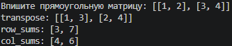
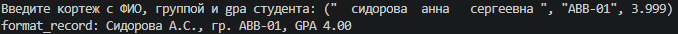

## Лабораторная работа №2: Коллекции и матрицы (list/tuple/set/dict)

### Задание 1 — arrays.py
* **Файл:** `src/lab02/arrays.py`
* **Ход работы:** `Программа реализует три функции для работы со списками. Функция min_max находит минимальное и максимальное значение в списке без использования встроенных функций min() и max(). Функция unique_sorted формирует отсортированный по возрастанию список уникальных элементов без использования функций sort() и sorted(). Функция flatten принимает список списков или кортежей и «распрямляет» его в один плоский одномерный список, проверяя типы данных.`
* **Результат работы:**

### Задание 2 — matrix.py
* **Файл:** `src/lab02/matrix.py`
* **Ход работы:** `Программа содержит функции для обработки двумерных списков (прямоугольных матриц). Функция transpose меняет строки и столбцы матрицы местами, предварительно проверяя её на «рваные» края. Функции row_sums и col_sums последовательно вычисляют суммы элементов по каждой строке и по каждому столбцу соответственно, генерируя исключение при нарушении прямоугольной формы таблицы.`
* **Результат работы:**

### Задание 3 — tuples.py
* **Файл:** `src/lab02/tuples.py`
* **Ход работы:** `Программа работает со структурами данных в виде кортежей, содержащих ФИО, учебную группу и средний балл (GPA) студента. Функция format_record очищает ФИО от лишних пробелов, извлекает первые буквы имени и отчества для формирования корректных инициалов в верхнем регистре, округляет GPA до двух знаков после запятой и выводит красиво форматированную строку по заданному шаблону.`
* **Результат работы:**

